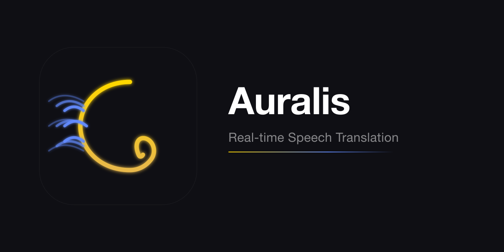

<p align="center">
  
</p>

<p align="center">
  
  
  
  
  
  
</p>

**Auralis** is a real-time speech translation overlay built with Tauri. It captures audio from your microphone or system, transcribes it, and displays translations in a compact glassmorphism window — with no intermediary server involved.

> 📖 Installation guides: [macOS (EN)](docs/installation_guide.md) · [macOS (VI)](docs/installation_guide_vi.md) · [Windows (EN)](docs/installation_guide_win.md) · [Windows (VI)](docs/installation_guide_win_vi.md)

---

## How It Works

```
System Audio / Mic → 16kHz PCM → Cloud (Soniox) or Offline (MLX Whisper) → Overlay UI
                                                                          ↓ (optional)
                                                                  TTS (Edge/Google/ElevenLabs) → 🔊
```

| Feature | Detail |
|---------|--------|
| **Latency** | ~150ms (Cloud) · ~3s (Offline) |
| **Languages** | 12 supported, one-way & two-way |
| **Cost** | ~$0.12/hr (Cloud) · Free (Offline) |
| **TTS** | 4 providers (Web Speech, Edge, Google, ElevenLabs) |
| **Platform** | macOS (ARM + Intel) · Windows |
| **Auto-Update** | ✅ Built-in, check & install from Settings |

---

## Features

### ☁️ Dual Mode — Cloud & Offline

| Mode | Speed | Quality | Cost | Internet |
|------|-------|---------|------|----------|
| **Cloud** (Soniox) | ~150ms | High | ~$0.12/hr | Required |
| **Offline** (MLX Whisper + Opus-MT) | ~3s | Good | Free | Not needed |

Offline mode runs 100% on-device using MLX Whisper for speech recognition and Opus-MT for translation. Models are downloaded automatically (~5 GB).

### 🎙️ System Audio Capture

Capture audio directly from:
- **Microphone** — your voice
- **System audio** — YouTube, Zoom, meetings (macOS via ScreenCaptureKit)
- **Both** — mixed mic + system audio

### 🔄 Two-Way Translation

Translate conversations between two languages simultaneously — ideal for bilingual meetings.

- **One-way**: Source → Target (e.g., English → Vietnamese)
- **Two-way**: Language A ↔ Language B — the app auto-detects who is speaking and translates to the other language

### 🎙️ TTS Narration

Read translations aloud — 4 providers:

| | Web Speech | Edge TTS | Google Cloud | ElevenLabs |
|-|-----------|----------|-------------|------------|
| **Cost** | Free | Free | Free tier | ~$5/mo+ |
| **Quality** | Basic | Natural | High | Premium |
| **Setup** | Built-in | None | API key | API key |

### 🖥️ Compact Overlay

600×400 borderless glassmorphism window that stays on top of other apps. Drag it anywhere, resize as needed. Adjustable opacity and font size for presentations.

---

## Privacy

**Your audio never touches our servers — because there are none.**

- App connects **directly** to APIs you configure — no relay, no middleman
- **You own your API keys** — stored locally, never transmitted elsewhere
- **No account, no telemetry, no analytics** — zero tracking

---

## Tech Stack

- **[Tauri 2](https://tauri.app/)** — Rust backend + Svelte 5 frontend
- **[ScreenCaptureKit](https://developer.apple.com/documentation/screencapturekit)** — macOS system audio
- **[cpal](https://github.com/RustAudio/cpal)** — Cross-platform microphone
- **[Soniox](https://soniox.com)** — Real-time STT + translation (cloud mode)
- **[MLX Whisper](https://github.com/ml-explore/mlx-examples)** — On-device speech recognition
- **[Opus-MT](https://huggingface.co/Helsinki-NLP)** — On-device translation
- **[Edge TTS](https://learn.microsoft.com/en-us/azure/ai-services/speech-service/index-text-to-speech)** — Free neural TTS
- **[Google Cloud TTS](https://cloud.google.com/text-to-speech)** — High-quality TTS
- **[ElevenLabs](https://elevenlabs.io)** — Premium TTS

---

## Build from Source

```bash
git clone https://github.com/nghiavan0610/auralis.git
cd auralis
npm install
npm run tauri build
```

Requires: Rust (stable), Node.js 18+, macOS 13+ or Windows 10+.

---

## License

MIT
